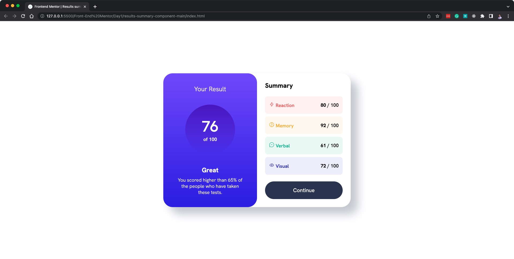
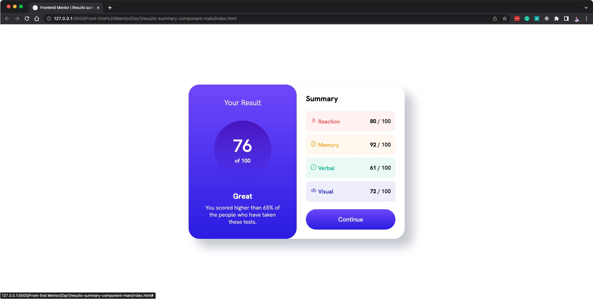
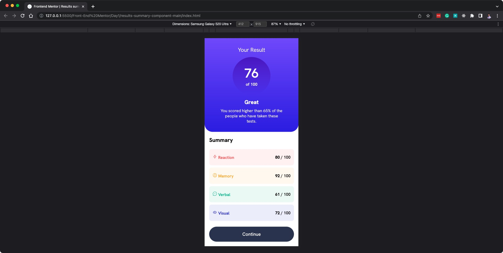

# Frontend Mentor - Results summary component solution

This is a solution to the [Results summary component challenge on Frontend Mentor](https://www.frontendmentor.io/challenges/results-summary-component-CE_K6s0maV). Frontend Mentor challenges help you improve your coding skills by building realistic projects.

## Table of contents

- [Overview](#overview)
  - [The challenge](#the-challenge)
  - [Screenshot](#screenshot)
  - [Links](#links)
- [My process](#my-process)
  - [Built with](#built-with)
  - [What I learned](#what-i-learned)
  - [Continued development](#continued-development)
  - [Useful resources](#useful-resources)
- [Author](#author)
- [Acknowledgments](#acknowledgments)

## Overview

### The challenge

Users should be able to:

- View the optimal layout for the interface depending on their device's screen size
- See hover and focus states for all interactive elements on the page

### Screenshot

#### Desktop

---

#### Mobile

### Links

- Solution URL: [Add solution URL here](https://your-solution-url.com)
- Live Site URL: [Add live site URL here](https://your-live-site-url.com)

## My process

### Built with

- Semantic HTML5 markup
- CSS custom properties
- Flexbox
- CSS Grid
- Mobile-first workflow

### What I learned

This is my first project in Front End Mentor and also my first time of implementing a pre-made design ready for implementation.

I learned how to properly implement a design by following these steps:

1. Before coding, it's important to not skip the **Planning Phase**. In this step, I learned that I should identify first the overall structure of the page and write the corresponding HTML elements for them.
2. After all the planning is done, it's time to start getting the variables and values (i.e. font size, colors, etc.) that will be needed for the project. I learned the importance of having a design system and that this can serve as the style guide for defining the css values. This stage also includes incorporating the fonts that will be used for the design (either importing locally or from a CDN).
3. After the HTML structure and CSS values are defined, it's time for CSS style implementation in a **Top Down approach**:
   i. **Layout** - start with the implementation of layout and structure of the website. Make it responsive and ensure a mobile-first development approach.
   ii. **Sections** - After the structure and layout of the website is defined, it's time to define the structure of each sections. The finer details can be added later, just structure each section in this stage.
   iii. **Details** - After the overall structure and layout of the page is defined, with each section properly defined, it's time to add the fine details per section.
   iv. **Polishing** - This stage is just for ensuring the implemented design matches the design as close as possible. This may also include code refactoring.
4. After the design is implemented and polished to be as close to the design as possible, it's time to submit it.

### Continued development

I still need to improve the way I plan on things. I later noticed myself going back and forth on the defined values and when implementing them, which is not a good sign.

I must improve on planning and how can I struicture my CSS.

I also need to learn how to properly structure the CSS project and how to properly define the CSS variables.

### Useful resources

- [Kevin Powell - From Design to Code | HTML & CSS from scratch](https://www.youtube.com/watch?v=KqFAs5d3Yl8&t=965s) - This helped me understand how to implement a design from scratch, including the steps I mentioned earlier. Thanks to this, I understood the process of how to properly implement a web design to a real website. I really liked this pattern and will use it going forward.

## Author

- Website - [menard-maranan.vercel.app](https://menard-maranan.vercel.app)
- LinkedIn - [Menard Maranan](https://www.linkedin.com/in/menard-maranan/)
- Frontend Mentor - [@menard-codes](https://www.frontendmentor.io/profile/menard-codes)
- Twitter - [@menard_codes](https://twitter.com/menard_codes)
- Dev(.)to - [@menard_codes](https://dev.to/menard_codes)

## Acknowledgments

I'd like to thank Keven Powell as his [YouTube videos](https://www.youtube.com/@KevinPowell) really helped me learn a lot of CSS topics.
