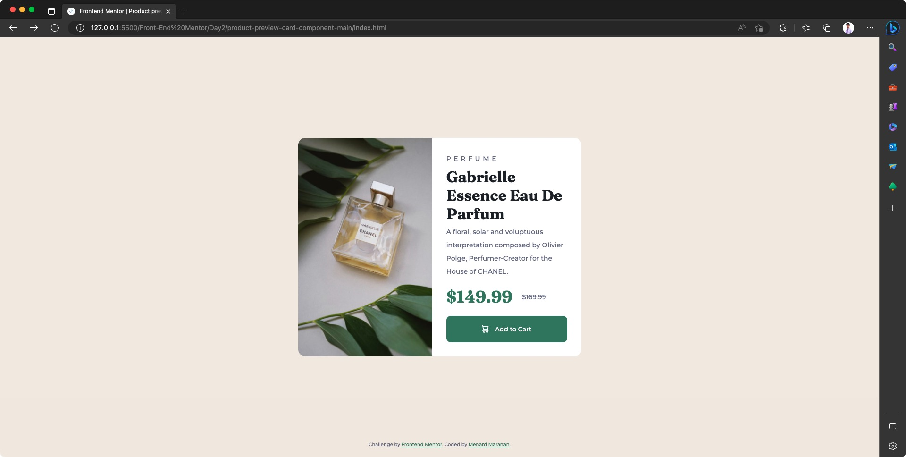
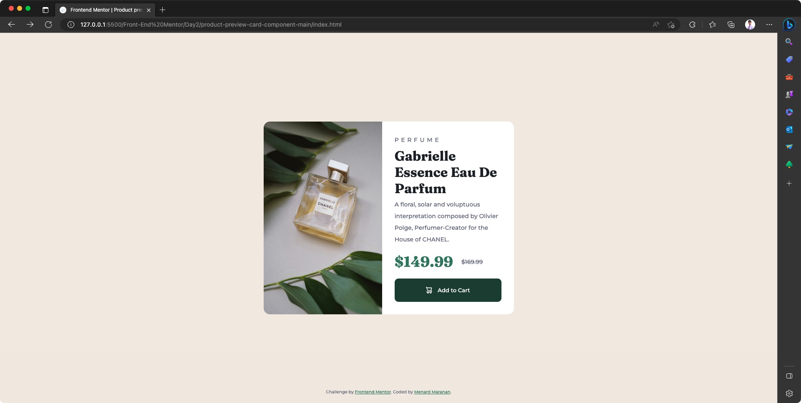
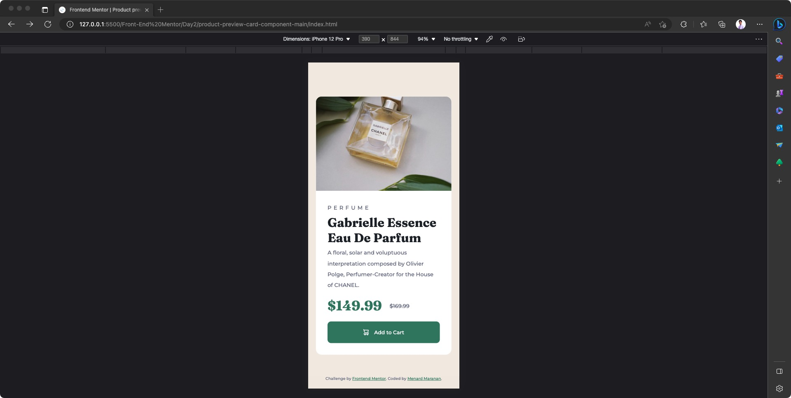

# Frontend Mentor - Product preview card component solution

This is a solution to the [Product preview card component challenge on Frontend Mentor](https://www.frontendmentor.io/challenges/product-preview-card-component-GO7UmttRfa). Frontend Mentor challenges help you improve your coding skills by building realistic projects.

## Table of contents

- [Overview](#overview)
  - [The challenge](#the-challenge)
  - [Screenshot](#screenshot)
  - [Links](#links)
- [My process](#my-process)
  - [Built with](#built-with)
  - [What I learned](#what-i-learned)
  - [Continued development](#continued-development)
  - [Useful resources](#useful-resources)
- [Author](#author)
- [Acknowledgments](#acknowledgments)

## Overview

### The challenge

Users should be able to:

- View the optimal layout depending on their device's screen size
- See hover and focus states for interactive elements

### Screenshot

#### Desktop





---

#### Mobile



### Links

- Live Site URL: [Add live site URL here](https://your-live-site-url.com)

## My process

### Built with

- Semantic HTML5 markup
- CSS custom properties
- Flexbox
- CSS Grid
- Mobile-first workflow

### What I learned

In this particular challenge, I learned something new about images, and how you can fine tune it for responsive design purposes. Part of this challenge required me to use two different images for two different screen sizes (mobile and desktop) which actually refers the same thing (the product image).

Since I have no idea how to implement this, I researched about it until I stumbled upon [this video by Kevin Powell](https://www.youtube.com/watch?v=B2WL6KkqhLQ&t=3405s). Funny thing is that this video is also about him taking this same front end mentor challenge. Particularly in this video, I learned about the HTML elements called `picture` and `source`, which are actually new to me. Kevin discussed about these HTML elements when he's also dealing with the same problem as mine (using two different images in different screen sizes).

Anyway, here's a code snippet of how I resolved my issue after learning about this from Kevin:

```html
<picture>
  <source
    srcset="./images/image-product-desktop.jpg"
    media="(min-width: 600px)"
  />
  
</picture>
```

In a nutshell, this allows the browser to pick and choose what image to render at what screen size. In here, I specified two attributes of the `source` element: `srcset` (to specify where the image is) and `media` (for the media query - to only render if screen width is greater than 600px). The default image rendered by the browser is the image referenced inside the `img` tag. But when the media query of the image referenced in the `source` tag was met, the browser uses the image it references in its `srcset` attribute to replace the referenced image at the `img` tag.

This is a great thing to learn especially I'm trying to improve my HTML/CSS and responsive design skills. Thankfully this challenge brought up this concept to me. This will definitely help me solve similar challenges in the future.

### Continued development

I'm looking forward to learning more about <em style="text-decoration: underline;">CSS clean coding concepts and best practices for having a maintainable codebase</em>:

I'd love to learn more about:

- **CSS Resets**
- <a style="text-decoration: underline" href="https://css-tricks.com/methods-organize-css/">Methods for Organizing CSS</a> (like BEM, SMACCS, Atomic, etc.)
- **Initial set up of CSS and proper way of defining styling values in variables**
- **CSS Preprocessors**, more specifically SASS
- **HTML Semantic Tags** and **Accessibility**

### Useful resource

- [Using different pictures in different screen sizes - Kevin Powell | YouTube](https://www.youtube.com/watch?v=B2WL6KkqhLQ&t=3405s)

## Author

- Website - [menard-maranan.vercel.app](https://menard-maranan.vercel.app)
- LinkedIn - [Menard Maranan](https://www.linkedin.com/in/menard-maranan/)
- Frontend Mentor - [@menard-codes](https://www.frontendmentor.io/profile/menard-codes)
- Twitter - [@menard_codes](https://twitter.com/menard_codes)
- Dev(.)to - [@menard_codes](https://dev.to/menard_codes)

## Acknowledgments

I'd like to thank Keven Powell as his [YouTube videos](https://www.youtube.com/@KevinPowell) really helped me learn a lot of CSS topics.
