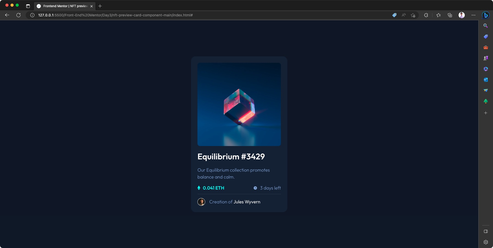
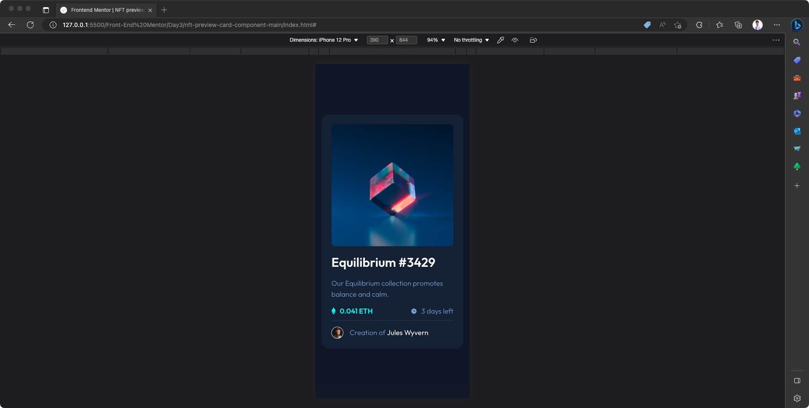

# Frontend Mentor - NFT preview card component solution

This is a solution to the [NFT preview card component challenge on Frontend Mentor](https://www.frontendmentor.io/challenges/nft-preview-card-component-SbdUL_w0U). Frontend Mentor challenges help you improve your coding skills by building realistic projects.

## Table of contents

- [Overview](#overview)

  - [The challenge](#the-challenge)
  - [Screenshots and Demo](#screenshots-and-demo)
  - [Links](#links)
  - [Built With](#built-with)

- [Author](#author)

## Overview

### The challenge

Users should be able to:

- View the optimal layout depending on their device's screen size
- See hover states for interactive elements

### Screenshots and demo

#### Demo

<video width="1920px" height="968px" controls>
  <source src="./ReadMeAssets/Demo-active-state.mov" />
</video>

#### Desktop

#### Mobile

### Links

- Live Site URL: [Add live site URL here](https://your-live-site-url.com)

## My process

### Built with

- Semantic HTML5 markup
- CSS custom properties
- Flexbox
- CSS Grid
- Mobile-first workflow

## Author

- Website - [menard-maranan.vercel.app](https://menard-maranan.vercel.app)
- LinkedIn - [Menard Maranan](https://www.linkedin.com/in/menard-maranan/)
- Frontend Mentor - [@menard-codes](https://www.frontendmentor.io/profile/menard-codes)
- Twitter - [@menard_codes](https://twitter.com/menard_codes)
- Dev(.)to - [@menard_codes](https://dev.to/menard_codes)
